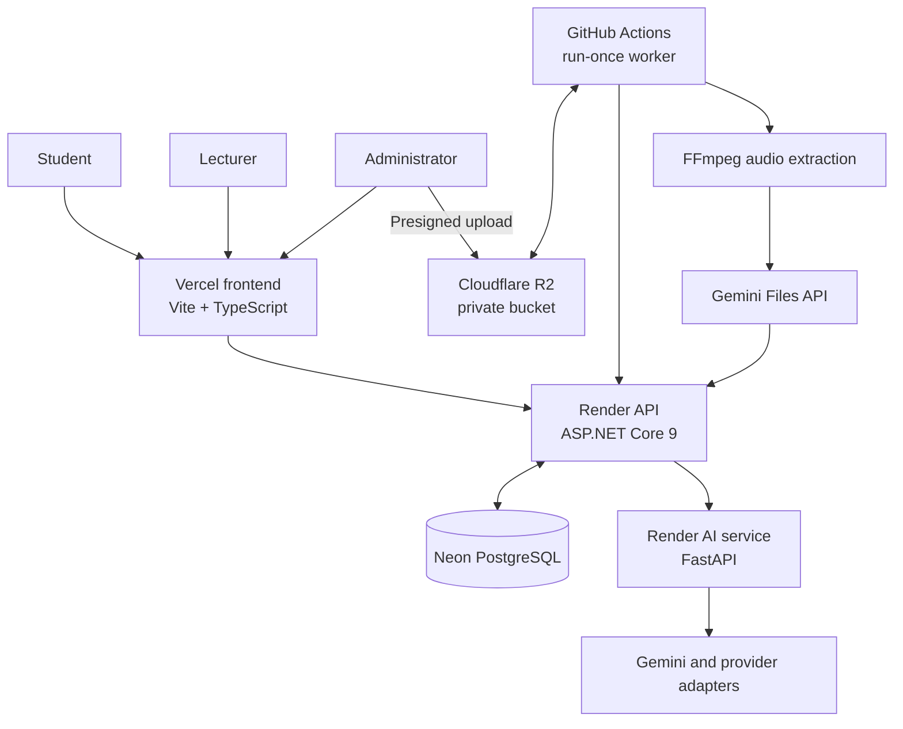
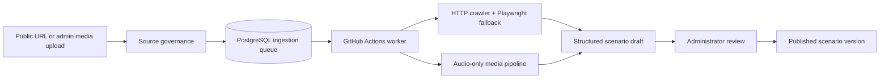

# ReqSimulator

[](https://github.com/voy32103-code/KLTN/actions/workflows/ci.yml)
[](LICENSE)
[](https://kltn-chi.vercel.app)

ReqSimulator is an AI-assisted learning platform for practicing requirements elicitation. A student interviews a virtual stakeholder, the system extracts and normalizes requirements from the transcript, and a lecturer can review the evidence and override the evaluation when appropriate.

This repository is an academic pilot. AI-generated scenarios are always drafts until an administrator reviews and publishes them.

## What it does

- Simulates stakeholder interviews with persona, patience, and progressive-disclosure controls.
- Extracts requirements into structured Actor–Action–Object–Condition (AAOC) data.
- Normalizes terms with a scenario glossary and matches extracted requirements to reviewed ground truth.
- Provides coverage, feedback that avoids leaking hidden requirements, and deterministic Use Case/ERD visualizations.
- Lets administrators ingest public web URLs or video/audio sources into scenario drafts.
- Supports JavaScript-rendered public websites with an HTTP crawler plus a Playwright fallback.
- Processes uploaded video as **audio only**: private R2 object storage → FFmpeg → Gemini Files API → draft → human review.

## Architecture



### Knowledge-ingestion flow



## Technology

| Layer | Stack |
| --- | --- |
| Frontend | Vite, TypeScript, vanilla CSS, Chart.js |
| API | ASP.NET Core 9, EF Core, Npgsql, JWT |
| AI service | FastAPI, Pydantic, Google GenAI, Playwright |
| Data and jobs | Neon PostgreSQL, Cloudflare R2, GitHub Actions |
| Deployment | Vercel frontend, Render API and AI service |

## Prerequisites

- .NET SDK 9
- Node.js 20 or later with pnpm 10
- Python 3.12
- PostgreSQL 15 or later for local development
- A Gemini API key for AI features

Optional for ingestion: an R2 bucket, FFmpeg, and GitHub repository secrets for the run-once worker.

## Run locally

### 1. Clone and configure

```powershell
git clone https://github.com/voy32103-code/KLTN.git
Set-Location KLTN

Copy-Item .\backend\ReqSimulator.API\.env.example .\backend\ReqSimulator.API\.env
Copy-Item .\ai-service\.env.example .\ai-service\.env
Copy-Item .\frontend\.env.example .\frontend\.env
```

The repository intentionally uses one environment file per service. Do not commit any `.env` file.

Set these values before starting the services:

| File | Required values |
| --- | --- |
| `backend/ReqSimulator.API/.env` | `ConnectionStrings__DefaultConnection`, `Jwt__Key`, `AiService__InternalKey` |
| `ai-service/.env` | `GEMINI_API_KEY`, `AI_SERVICE_INTERNAL_KEY` (the same value as the API) |
| `frontend/.env` | `VITE_API_BASE_URL` |

For the ingestion feature, also configure `R2__*`, `Ingestion__WorkerKey`, `INGESTION_BACKEND_URL`, and `INGESTION_WORKER_KEY`. Every secret must be at least 32 random characters where indicated.

### 2. Start the AI service

```powershell
Set-Location .\ai-service
py -3.12 -m venv .venv
.\.venv\Scripts\python.exe -m pip install -r requirements.txt
.\.venv\Scripts\python.exe -m uvicorn app.main:app --reload --host 127.0.0.1 --port 8000
```

### 3. Start the API

Open a second terminal from the repository root:

```powershell
dotnet restore .\KLTN.sln
dotnet run --project .\backend\ReqSimulator.API
```

The API normally listens at `http://localhost:5206` in local development. It applies its versioned database schema updates during startup; use an isolated local database, never a production database.

### 4. Start the frontend

Open a third terminal:

```powershell
Set-Location .\frontend
corepack enable
pnpm install --frozen-lockfile
pnpm run dev
```

Open the URL printed by Vite, usually `http://localhost:5173`.

## Tests and quality checks

```powershell
# API: build and unit tests
dotnet restore .\KLTN.sln
dotnet build .\KLTN.sln -c Release --no-restore
dotnet test .\backend\ReqSimulator.API.UnitTests\ReqSimulator.API.UnitTests.csproj -c Release --no-build

# AI service tests
Set-Location .\ai-service
.\.venv\Scripts\python.exe -m unittest discover -s tests -v

# Frontend contract tests and production build
Set-Location ..\frontend
pnpm test
pnpm run build

# Browser tests (optional locally; required in CI)
pnpm exec playwright install chromium
pnpm run test:e2e
pnpm run test:a11y
```

The integration-test project needs a dedicated PostgreSQL database with `test` or `integration` in its name. Do not point it at a shared Neon production branch.

## Deployment configuration

| Service | Platform | Required configuration |
| --- | --- | --- |
| Frontend | Vercel | `VITE_API_BASE_URL` points to the API URL |
| API | Render | PostgreSQL, JWT, AI internal key, CORS, and R2 settings |
| AI service | Render | Gemini key, matching AI internal key, allowed CORS origins |
| Queue worker | GitHub Actions | `INGESTION_BACKEND_URL`, `INGESTION_WORKER_KEY`, `GEMINI_API_KEY` repository secrets |
| Database | Neon | PostgreSQL connection string in the API configuration |
| Artifacts | Cloudflare R2 | Private bucket with CORS limited to the Vercel origin |

The ingestion worker is intentionally run once per GitHub Actions execution to stay within a student/free-tier deployment model. A queued job remains durable in PostgreSQL until a workflow run claims it.

## Security boundaries

- Only administrators can ingest knowledge sources or publish scenarios.
- URL ingestion accepts public HTTP(S) URLs only; the crawler applies SSRF protections and a JavaScript-rendering fallback.
- R2 artifacts stay private. The browser receives a short-lived presigned upload URL, and the worker receives a short-lived download URL.
- The API and AI service use a separate internal key; provider keys remain server-side or in GitHub Actions secrets.
- Source content is treated as untrusted before it reaches an AI provider. Generated drafts require human review.

## Contributing

1. Create a focused branch.
2. Run the checks in [Tests and quality checks](#tests-and-quality-checks).
3. Do not commit `.env`, R2 credentials, database URLs, or generated media.
4. Use the issue templates for bugs and feature requests.

Please read the issue forms before opening a report. Reproducible steps and redacted logs help maintainers respond quickly.

## License

Licensed under the [MIT License](LICENSE).

## Project status

The first public milestone is **v0.1.0**. It establishes the reviewed scenario workflow, durable ingestion queue, audio-only media pipeline, accessibility checks, and CI validation.
