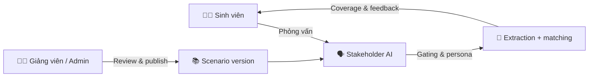
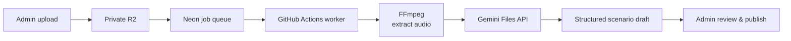
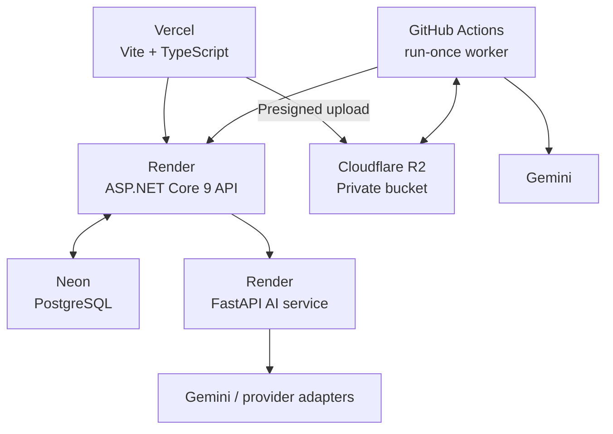

<p align="center">
  <h1 align="center">🧭 ReqSimulator</h1>
  <p align="center">
    Nền tảng mô phỏng phỏng vấn stakeholder bằng AI cho môn Kỹ nghệ yêu cầu.
    <br />
    <strong>Hỏi đúng hơn. Khai thác sâu hơn. Review có căn cứ.</strong>
  </p>
</p>

<p align="center">
  <a href="https://kltn-chi.vercel.app"><strong>Khám phá ứng dụng »</strong></a>
  ·
  <a href="#-bắt-đầu-nhanh">Bắt đầu nhanh</a>
  ·
  <a href="#-nạp-tri-thức-từ-nguồn-nghiệp-vụ">Nạp tri thức</a>
  ·
  <a href="#-kiến-trúc">Kiến trúc</a>
</p>

<p align="center">
  <a href="https://github.com/voy32103-code/KLTN/actions/workflows/ingestion-worker.yml">
    
  </a>
  
  
  
  
  
</p>

> [!IMPORTANT]
> Đây là công cụ học tập/pilot có **human review**. Scenario do AI sinh ra luôn
> ở dạng bản nháp; chỉ Admin mới có thể kiểm tra và publish.

## ✨ Vì sao ReqSimulator?

| 🎓 Học bằng thực hành | 🤖 AI có kiểm soát | 🧑‍🏫 Giảng viên làm chủ |
| --- | --- | --- |
| Sinh viên phỏng vấn stakeholder ảo, thay vì chỉ học lý thuyết requirement. | Progressive disclosure và hidden requirements giúp AI không tiết lộ đáp án quá sớm. | Review transcript, điều chỉnh kết quả, tạo và publish scenario theo phiên bản. |



## 🚀 Chức năng nổi bật

| Nhóm | Có gì trong hệ thống |
| --- | --- |
| **Phỏng vấn mô phỏng** | Persona, mood/patience, question-quality, progressive disclosure và consistency guard. |
| **Đánh giá requirement** | Extraction/normalization Actor–Action–Object–Condition, matching một-một, coverage và learning feedback. |
| **Quản trị học phần** | Role `Student` / `Lecturer` / `Admin`, scenario versioning, lecturer override và audit trail. |
| **Knowledge ingestion** | Crawler URL công khai có Playwright fallback cho SPA; upload video/audio với private R2 và worker bất đồng bộ. |

## 🎬 Nạp tri thức từ nguồn nghiệp vụ

### URL công khai

`Public URL → SSRF guard → HTTP fetch → Playwright fallback → Gemini → Scenario draft`

Chỉ Admin được nạp URL. Hệ thống ưu tiên HTTP để tiết kiệm tài nguyên, chỉ mở
trình duyệt Playwright cho trang SPA render JavaScript.

### Video/audio — audio-only



- Video/audio tối đa **250 MB**; video được chuyển thành MP3 128 kbps, 44.1 kHz.
- Chỉ audio được gửi đến Gemini: đây là **trích xuất tri thức qua lời nói**,
  không phải fine-tuning và không đọc hình ảnh không có thuyết minh.
- Worker chạy một job mỗi run. Khi UI báo `Job queued — chạy GitHub Action.`,
  Admin chạy workflow thủ công hoặc chờ lịch hằng ngày lúc **10:17 giờ Việt Nam**.

> [!NOTE]
> Chỉ dùng video/audio do người vận hành sở hữu hoặc có quyền sử dụng. Video
> công khai không mặc nhiên cho phép tải lại hoặc gửi nội dung đến AI provider.

## 🏗️ Kiến trúc



| Layer | Công nghệ | Trách nhiệm |
| --- | --- | --- |
| Frontend | Vite, TypeScript, Vanilla CSS, Chart.js | Student lab, lecturer review, Admin console và upload progress. |
| Backend | ASP.NET Core 9, EF Core, Npgsql | JWT, role, API, sessions, scenario versioning, queue và R2 presigned URLs. |
| AI service | FastAPI, Pydantic, NumPy, Google GenAI | Persona, gating, extraction, evaluation, crawler và provider adapters. |
| Data & jobs | Neon PostgreSQL, Cloudflare R2, GitHub Actions | Dữ liệu bền vững, artifact private và xử lý media chi phí thấp. |

## 🔐 Các ranh giới bảo vệ

| Boundary | Cách kiểm soát |
| --- | --- |
| Người dùng | JWT, role-based authorization và rate limiting. |
| Ground truth | Không trả hidden requirements về client; gating fail-closed. |
| AI service | Khóa nội bộ `X-AI-Service-Key`; provider key chỉ nằm ở môi trường server/Actions. |
| Media | R2 private, presigned URL có hạn, worker key riêng, validate media và cleanup artifact tạm. |
| AI output | Prompt coi nội dung nguồn là untrusted, structured JSON validation, bắt buộc Admin review. |

## ⚡ Bắt đầu nhanh

<details>
<summary><strong>1. Chuẩn bị môi trường</strong></summary>

Yêu cầu: .NET SDK 9, Node.js 20+, pnpm, Python **3.12** và PostgreSQL dành
riêng cho local/test.

Sao chép `.env.example` trong `backend/ReqSimulator.API`, `ai-service` và
`frontend`. Không dùng secret production trên máy local.
</details>

<details>
<summary><strong>2. Chạy ba service</strong></summary>

```powershell
# API — http://localhost:5206
dotnet restore .\KLTN.sln
dotnet run --project .\backend\ReqSimulator.API

# Frontend — terminal khác
Set-Location .\frontend
pnpm.cmd install --frozen-lockfile
pnpm.cmd run dev

# AI service — terminal khác
Set-Location ..\ai-service
py -3.12 -m venv .venv
.\.venv\Scripts\python.exe -m pip install -r requirements.txt
.\.venv\Scripts\python.exe -m uvicorn app.main:app --reload --host 127.0.0.1 --port 8000
```
</details>

<details>
<summary><strong>3. Kiểm tra trước khi thay đổi</strong></summary>

```powershell
# .NET
dotnet build .\KLTN.sln -c Release --no-restore
dotnet run --project .\backend\ReqSimulator.API.UnitTests\ReqSimulator.API.UnitTests.csproj -c Release --no-build

# Frontend
Set-Location .\frontend
pnpm.cmd run build
pnpm.cmd test
pnpm.cmd exec playwright install chromium
pnpm.cmd exec playwright test

# AI service
Set-Location ..\ai-service
.\.venv\Scripts\python.exe -m unittest discover -s tests -v
```

> [!CAUTION]
> Backend integration suite ghi vào PostgreSQL. Chỉ chạy với database có tên
> `test` hoặc `integration`; không dùng Neon production.
</details>

## 🧪 Checklist demo

- [ ] Đăng nhập đúng role: Student, Lecturer hoặc Admin.
- [ ] Student tạo session, hỏi stakeholder và kết thúc phiên.
- [ ] Lecturer review transcript/evaluation hoặc thực hiện override có lý do.
- [ ] Admin tạo scenario và publish sau khi review.
- [ ] Với ingestion: upload nguồn, chạy GitHub Action, kiểm tra trạng thái
      `AwaitingReview` rồi mới publish.

## 🗺️ Giới hạn và hướng phát triển

- Video ingestion hiện là audio-only; text/sơ đồ xuất hiện im lặng trong video
  không được trích xuất.
- GitHub Actions run-once là trade-off free tier: độ trễ cao hơn worker liên tục
  nhưng queue vẫn bền trong PostgreSQL.
- Trước khi tăng thời lượng video, lưu lượng hoặc tự động hóa, cần đánh giá lại
  lease worker, observability, dependency lock và lifecycle artifact.

## 📁 Tài liệu nội bộ

Audit, runbook deployment, video-ingestion guide và tài liệu nghiên cứu được
giữ trong `docs/` trên môi trường nội bộ. Thư mục này bị Git ignore và không
được công bố trong repository; không đưa secret hay dữ liệu vận hành vào GitHub.

<p align="center">
  <sub>Built for learning requirement elicitation through deliberate practice.</sub>
</p>
